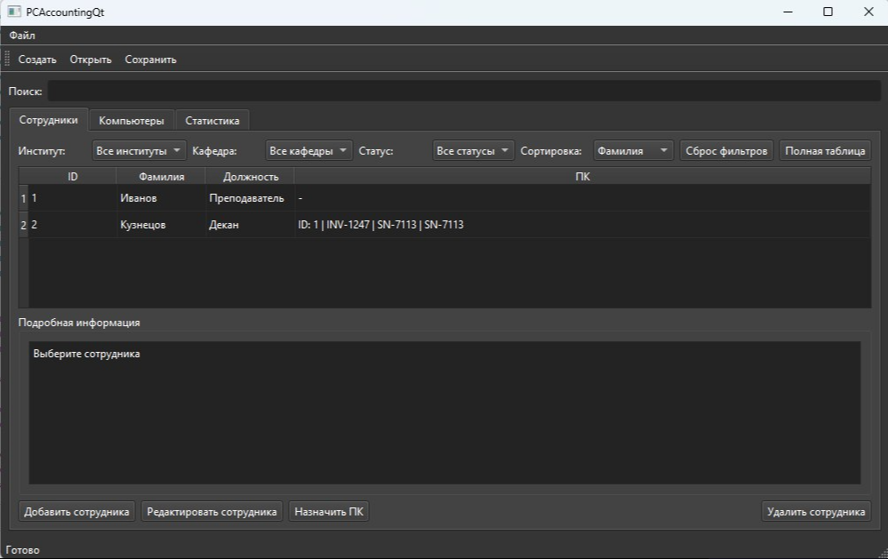

# PCAccounting

Десктопное приложение на **Qt 6 (C++)** для учета сотрудников и закрепленных за ними ПК.

## Что умеет

- управление сотрудниками: добавление, редактирование, удаление;
- управление компьютерами: добавление, редактирование, удаление;
- связь сотрудник <-> ПК (назначение, отвязка, переназначение);
- фильтры и сортировка:
  - сотрудники: по институту, кафедре, статусу;
  - ПК: по RAM, объему диска, состоянию обслуживания (ТО);
- полноформатные таблицы по сотрудникам и ПК;
- поиск по ключевым полям;
- отчеты по RAM;
- сохранение/загрузка базы с шифрованием;
- валидация данных и проверка целостности перед сохранением.

## Технологии

- C++17
- Qt 6 Widgets
- CMake
- bcrypt (для криптографической части)

## Структура проекта

```text
PCAccountingQt/
  main.cpp
  mainwindow*.cpp/h
  EmployeesTabWidget.*
  ComputersTabWidget.*
  StatsTabWidget.*
  EmployeeDialog.*
  ComputerDialog.*
  projects/
    src/
      core/
      storage/
      crypto/
      models/
      utils/
```

## Сборка (Windows, Qt + MinGW)

```bash
cmake -S . -B build
cmake --build build
```

Если у тебя несколько toolchain, проверь что используется корректный MinGW/Qt комплект.

## Запуск

После сборки исполняемый файл находится в папке `build` (конкретный путь зависит от генератора/IDE).

## Скриншоты

> Ниже оставлены места под твои изображения.

### Главное окно


### Вкладка сотрудников



### Вкладка компьютеров


### Фильтры и сортировка


### Полные таблицы


## Планы на развитие

- экспорт отчетов (CSV/PDF);
- роли пользователей и разграничение прав;
- история изменений по сущностям;
- автонапоминания по ТО/гарантии.

## Автор

**Diwan1337**
